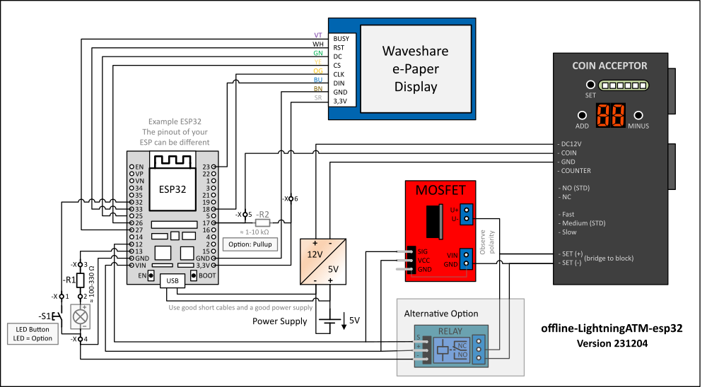
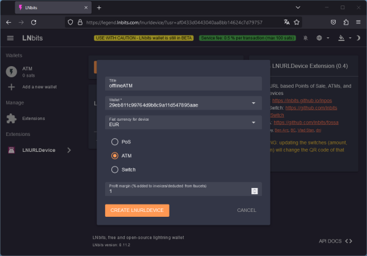
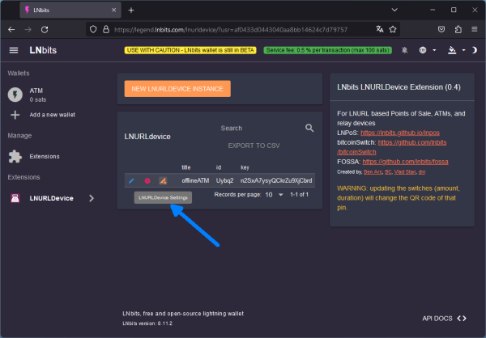

# offline-LightningATM-esp32
Bitcoin ATM (coins only) with lightning network support, running offline on an esp32. 
The lightning network is a 2nd layer protocol on top of the bitcoin protocol enabling trustless transactions with instant settlement and cheap fees.

## Special thanks to
@21isenough and contributors for the 3d models and inspiration  
[RPi based Lightning ATM repo](https://github.com/21isenough/LightningATM)

LNBits, Ben Arc and Stepan Snigirev for the cryptograpy used to make this ATM working without internet connection  
[Fossa repository](https://github.com/lnbits/fossa) | [LNBits Homepage](https://lnbits.com/)

Axel Hambuch for the very detailed guide in german language on assembly of the electronics  
[Ereignishorizont Blog](https://ereignishorizont.xyz/lightning-atm/)

## Used parts
All the parts are available on eBay and Aliexpress

* ESP32 NodeMCU Dev Board | Any "normal" esp32 dev board should do the job here | [Example](https://web.archive.org/web/20231202141343/https://www.berrybase.de/en/esp32-nodemcu-development-board)
* DC-DC Adjustable Step-up Boost Power Supply LM2587S 5V -> 12V | for the coin acceptor, runs on 12V [Example](https://de.aliexpress.com/item/32834930982.html)
* Waveshare 1.54 inch e-Paper Display Modul with SPI Interface | [Example](https://www.waveshare.com/1.54inch-e-paper-module.htm)
* Programmable Coin Acceptor (HX-616) - 6 Coin | [Example](https://de.aliexpress.com/item/1005005203759184.html)
* 10mm Metal Push Button Switch 3-6V with Yellow LED, Self-reset Momentary | [Example](https://de.aliexpress.com/item/1005004527235094.html)
* USB Type C socket | to plug in the power supply (i used a Raspberry Pi type C power supply) [Example](https://de.aliexpress.com/item/1005005347655323.html)
* Little Mosfet modules ("15A 400W MOS FET Trigger") | To block the coin acceptor at certain points [Example](https://de.aliexpress.com/item/33038160184.html)
* Orange PLA Filament for the 3D Printer | [Example](https://us.polymaker.com/products/polylite-pla)
* Jumper Wires | [Example](https://de.aliexpress.com/item/1005005945668553.html)
* Heat-Set Threaded Inserts M3 | [Example](https://www.prusa3d.com/product/threaded-inserts-m3-standard-100-pcs/)

All in all would calculate around $100 for the neccessary parts

# Assembly Instructions for Lightning ATM

## 1. Connecting the Waveshare 1.54 inch Display to the ESP32

Begin by connecting the Waveshare display to the ESP32 using the following pin assignments:

| Display Pins | ESP32 GPIO |
|--------------|------------|
| Busy         | 27         |
| RST          | 33         |
| DC           | 25         |
| CS           | 26         |
| CLK          | SCK = 18   |
| DIN          | MOSI = 23  |
| GND          | GND        |
| 3.3V         | 3.3V       |

## 2. Programming the Coin Acceptor

Ensure to adjust the voltage of the step-up converter before connecting the coin acceptor. Detailed programming instructions are available in the following guides:
- [Coin Acceptor Programming Guide (English)](https://github.com/21isenough/LightningATM/blob/master/docs/guide/coin_validator.md)
- [Coin Acceptor Programming Guide (German)](https://ereignishorizont.xyz/lightning-atm/)

## 3. Connecting the Coin Acceptor to the ESP32

- For the Coin <-> Pin 17 connection, use a cable as short as possible.
- Short circuit the two pins below the switch on the coin acceptor with the MOSFET on GND IN and GND OUT.
- Connect the MOSFET GND pin to the ESP32 GND and the PWM pin to the pin specified in `include/lightning_atm.h`.

| Periphery Pin            | ESP32 GPIO |
|--------------------------|------------|
| Coin Acceptor 'Coin Pin' | 17         |
| Mosfet PWM Pin           | 12         |
| Mosfet GND Pin           | GND        |

## 4. Connecting the LED Button

Connect the LED Button to the ESP32 according to the pin assignments specified in `include/lightning_atm.h`:

| Periphery Pin             | ESP32 GPIO |
|---------------------------|------------|
| Button LED Pin (+)        | 13         |
| Button LED Pin (-)        | GND        |
| Button PIN 1              | 32         |
| Button PIN 2              | GND        |

For wiring inspiration and guidance, refer to [Lightning ATM Documentation](https://github.com/21isenough/LightningATM/tree/master/docs).

## 5. Circuit Diagram

Refer to the circuit diagram below for a visual representation of the wiring:

You can power the ESP32 either trough the MicroUSB port or over the VIN and GND pins.

## Setup software

1. Install VSCode and the PlattformIO IDE Extension.
2. Clone this repository and open it as PlattformIO Project.
3. Create an [LNbits](https://legend.lnbits.com/) wallet. Add the LNURLDevice extension and create a new LNURLDevice instance with ATM.

    

4. Copy the LNURLDevice Settings String and paste it into the code under “include/lighting_atm.h” under “USER ACTION”.

    

5. Flash the software on the esp32. You may have to disconnect the ESP32 from the step up converter before connecting it to the computer to prevent faults, or power it up with the power supply and use an usb isolator.

If you need help ask me on Nostr @npub1z9n5ktfjrlpyywds9t7ljekr9cm9jjnzs27h702te5fy8p2c4dgs5zvycf

If this software and guide provided value to you feel free to send some sats to x@lnaddress.com

## Images

